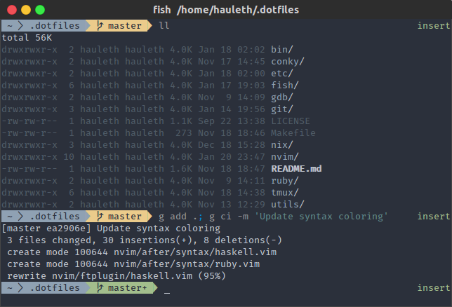

Dotfiles
========

It is repository of my config files, created as backup in case of UFO/armageddon
or (which is less probably) loosing my data.

You can feel free to use it for yourself, and even contribute if you want. Just
suggest something in [issues](https://github.com/hauleth/dotfiles/issues) or
create pull request (no link because if you need it, I rather won't accept your
pull request).

Installation
------------

Installation easy (but easier way will come in future):

1. Clone whole repo

        $ git clone --recursive https://github.com/hauleth/dotfiles.git && cd dotfiles

2. Run

        $ make

3. To install only some of the files use:

        $ make <targets>

Available targets
-----------------

  * `bin`
    - `git cleanup`
  * `fish`
  * `git`
    - global `.gitignore`
    - NeoVim + Fugitive as mergetool
  * `nvim`
    - vim-plug
    - bunch of plugins (check [`init.vim`](nvim/init.vim))
  * `ruby`
    - `.gemrc` (skip doc installation)
    - `.pryrc`
  * `utils`
    - `ctags` with Rust config
    - `.dir_colors` for Solarized theme

Copyrights
----------

Copyrights (c) 2013 [Łukasz Niemier][blog]

[t]: http://twitter.com/hauleth "Just follow me"
[blog]: http://lukasz.niemier.pl "Awesome Fantasy Rubist"
